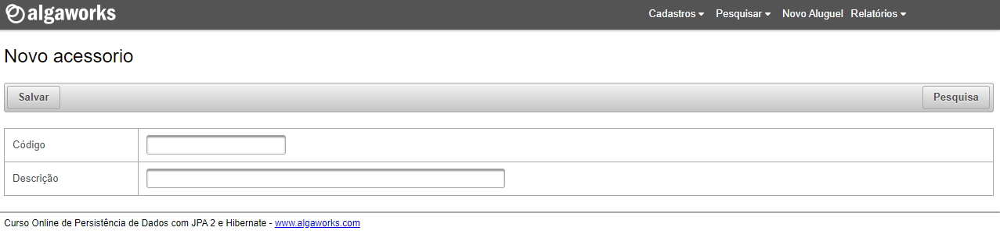
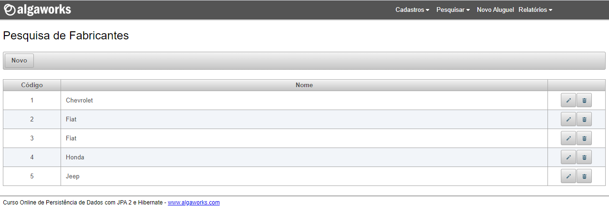
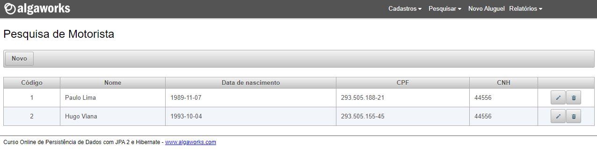

# Curso JPA e Hibernate além do básico - Algaworks

- [1. Introdução](#parte1)   
- [2. Iniciando com JPA 2](#parte2)   
- [3. Preparando o ambiente](#parte3)   
- [4. Mapeamento Objeto-Relacional](#parte4)   
- [5. Conceitos e mapeamentos avançados - parte 1](#parte5)   
- [6. Trabalhando com consultas](#parte6)   
- [7. Conhecendo mais sobre o Entity Manager](#parte7)   
- [8. Consultas com Criteria](#parte8)   
- [9. Gravação e exclusão em cascata](#parte9)   
- [10. Conceitos e mapeamentos avançados - parte 2](#parte10)   
- [11. Outros detalhes importantes](#parte11)   

# Curso de JPA e Hibernate além do basico - Algaworks

### Tela Inicial 

### Cadastro de Fabricante

### Cadastro de Modelo de Carro 

### Cadastro de Acessorios

### Cadastro de Carro

### Cadastro de Motorista

### Pesquisa de Fabricante 

### Pesquisa de Modelo Carro 

### Pesquisa de Acessorios 

### Pesquisa de Carros 

### Pesquisa de Motoristas 

### Relatorios 

